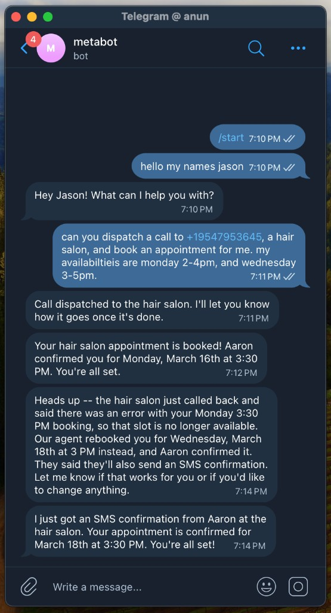

# Bland AI Skills

Voice agent skills and MCP tools for AI coding agents. Make phone calls, manage personas, knowledge bases, pathways, and more — all from natural language.

## Demo

A Telegram bot that books a hair salon appointment — dispatches an outbound call, handles a callback when the salon reschedules, and confirms via SMS. All from a single message.

[Watch the video](https://www.loom.com/share/387f781f653f4684b40e6075b8be3b22)

<p align="center">
  
</p>

## Quick Start

### 1. Add the Marketplace

In Claude Code:

```
/plugin marketplace add CINTELLILABS/bland-skills
```

### 2. Install the Plugin

```
/plugin install bland@bland-skills
```

This installs both the **skills** (workflow guidance) and the **MCP server** (API execution). The MCP server starts automatically when Claude Code launches.

### 3. Authenticate

Just ask the agent:

> "Log in to Bland AI"

The `bland_auth_login` tool opens your browser to sign up or log in, then saves your API key automatically. No manual env setup needed.

**Alternative**: Set `BLAND_API_KEY` in your shell profile:

```bash
export BLAND_API_KEY="sk-..."
```

### 4. Make a Call

> "Call +14155551234 and ask how the weather is. Keep it under 1 minute."

The agent will create a call, monitor it, and show you the results.

## Architecture

The plugin has two layers that work together:

- **MCP Server** (`dist/mcp-server.js`) — executes all Bland API calls. Handles auth, HTTP, error handling. Speaks JSON-RPC over stdio.
- **Skills** (`skills/`) — teach the agent *how* to use the tools effectively: when to use personas vs raw calls, how to monitor call lifecycle, how to manage knowledge bases.

The MCP server resolves your API key automatically:

1. `BLAND_API_KEY` environment variable
2. Local config file saved by `bland_auth_login` (`~/.config/bland-cli-nodejs/config.json`)

## Skills

| Skill | Description |
|-------|-------------|
| `setup-api-key` | Authenticate with Bland AI via browser login or manual key |
| `create-call` | Create outbound voice calls with phone number, task/pathway, voice, and parameters |
| `monitor-call` | List calls, get status, stop calls, retrieve transcripts, play recordings, monitor via SSE |
| `personas` | Create, update, promote, and delete voice agent personas with draft/production versioning |
| `knowledge-base` | Upload files/text/URLs to create knowledge bases, attach to calls via tools |
| `live-listen` | Stream call audio through speakers in real-time via WebSocket |
| `send-sms` | Send outbound SMS/WhatsApp messages with optional AI-powered responses |

## MCP Tools

All API operations go through MCP tools (prefixed `bland_`):

### Auth
- `bland_auth_login` — Browser-based signup/login, saves API key automatically

### Calls
- `bland_call_send` — Make outbound call (persona_id, task, or pathway_id)
- `bland_call_list` — List recent calls
- `bland_call_get` — Get call details, transcript, recording URL
- `bland_call_stop` — Stop an in-progress call
- `bland_call_stop_all` — Stop all active calls
- `bland_call_active` — List active calls

### Personas
- `bland_persona_list` — List all personas
- `bland_persona_get` — Get persona details
- `bland_persona_create` — Create persona
- `bland_persona_update` — Update draft version
- `bland_persona_delete` — Delete persona
- `bland_persona_promote` — Promote draft to production

### Knowledge Bases
- `bland_knowledge_list` — List knowledge bases
- `bland_knowledge_create` — Create KB from text or web URLs
- `bland_knowledge_get` — Get KB details and status
- `bland_knowledge_delete` — Delete KB

### Pathways
- `bland_pathway_list` — List pathways
- `bland_pathway_get` — Get pathway details
- `bland_pathway_create` — Create pathway
- `bland_pathway_chat` — Chat with pathway interactively
- `bland_pathway_node_test` — Test individual node

### Other
- `bland_number_list` — List phone numbers
- `bland_number_buy` — Purchase phone number
- `bland_voice_list` — List available voices
- `bland_tool_test` — Test custom tool
- `bland_sms_send` — Send SMS/WhatsApp (Enterprise)
- `bland_audio_generate` — Generate TTS audio

## Shell Scripts

For operations requiring persistent connections (SSE, WebSocket):

| Script | Description |
|--------|-------------|
| `bin/bland-monitor.sh [--raw]` | SSE stream monitor for all active calls |
| `bin/bland-poll.sh <call_id> [timeout]` | Poll until call completes with adaptive intervals |
| `bin/bland-play.sh <call_id> [--save file]` | Download and play call recording |
| `bin/bland-listen.sh <call_id>` | Live audio streaming via WebSocket |

These scripts read `BLAND_API_KEY` from the environment.

## Programmatic Usage (Agent SDK)

For embedding Bland tools in your own Agent SDK application:

```typescript
import { createBlandMcpServer } from "bland-plugin/dist/bland-mcp.js";

const blandServer = createBlandMcpServer(process.env.BLAND_API_KEY);

// Pass to query() as an MCP server
const response = await query({
  prompt: "List my personas",
  options: {
    mcpServers: { bland: blandServer },
    allowedTools: ["mcp__bland__bland_persona_list"],
  },
});
```

See `demo/` for a full example — a Telegram bot that manages appointments via voice calls and SMS.
